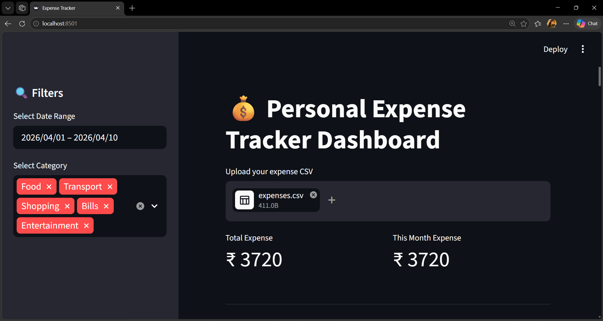
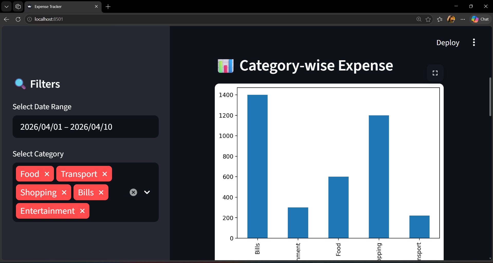
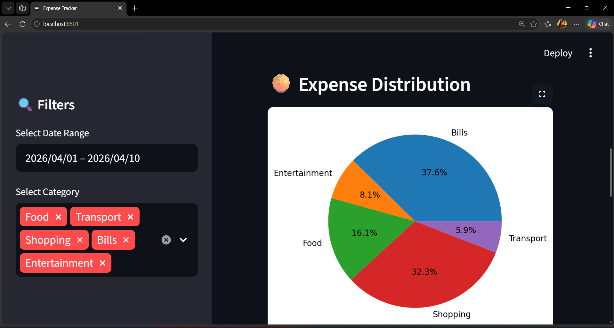
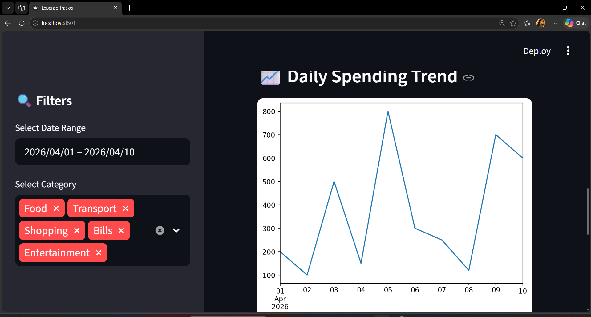
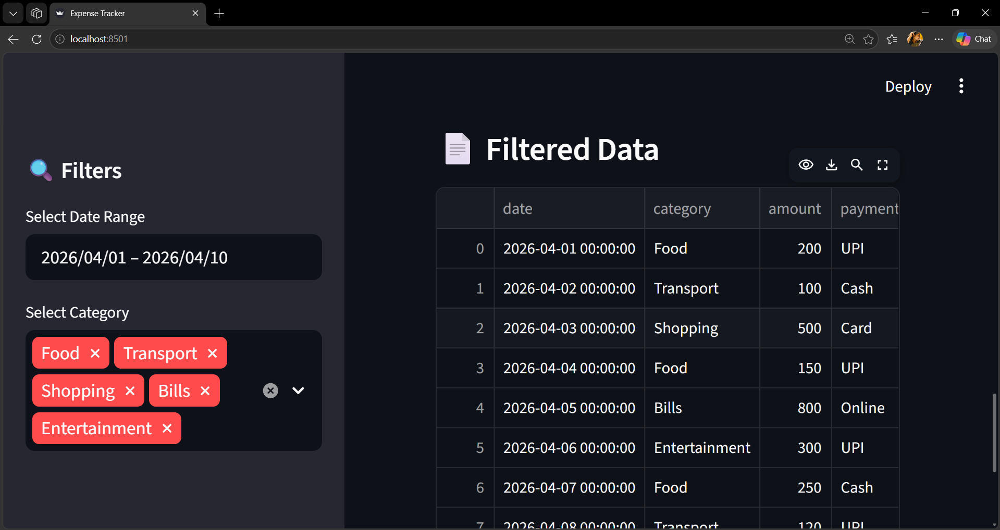

# 💰 Personal Expense Tracker Dashboard

An interactive data-driven dashboard to track, analyze, and visualize personal expenses using Python and Streamlit.

---

## 📌 Overview

This project helps users understand their spending patterns through visual insights like category-wise expenses, daily trends, and monthly summaries.

---

## 🚀 Features

* 📂 Upload expense CSV file
* 💰 Total expense calculation
* 📊 Category-wise expense analysis
* 🥧 Expense distribution (Pie chart)
* 📈 Daily spending trend
* 📅 Monthly expense summary
* 🎛 Interactive filters (date & category)
* 💾 Export filtered data

---

## 🛠️ Tech Stack

* Python 🐍
* Pandas
* Matplotlib
* Seaborn
* Streamlit

---

## 📂 Project Structure

```
Personal-Expense-Tracker/
│
├── app/            # Streamlit dashboard
├── src/            # Data processing scripts
├── data/           # Sample dataset
├── outputs/        # Screenshots & generated files
├── reports/        # Project documentation
├── requirements.txt
└── README.md
```

---

## 📊 Dashboard Preview

### 🔹 Dashboard Overview



### 🔹 Category-wise Expense



### 🔹 Expense Distribution



### 🔹 Daily Spending Trend



### 🔹 Monthly Summary



---

### 🔹 Demo Video

https://youtu.be/mafY8h_go4I

---

## 📁 Sample Data Format

```csv
date,category,amount
2026-05-01,Food,200
2026-05-02,Transport,100
2026-05-03,Shopping,800
```

---

## ▶️ How to Run

```bash
# Clone repository
git clone <your-repo-link>

# Navigate to project
cd Personal-Expense-Tracker

# Create virtual environment
python -m venv venv

# Activate (Windows)
venv\Scripts\activate

# Install dependencies
pip install -r requirements.txt

# Run app
streamlit run app/app.py
```

---

## 🎯 Outcome

This project provides meaningful insights into spending behavior and helps users make better financial decisions.

---

## 👨‍💻 Author
S. Hemalatha
